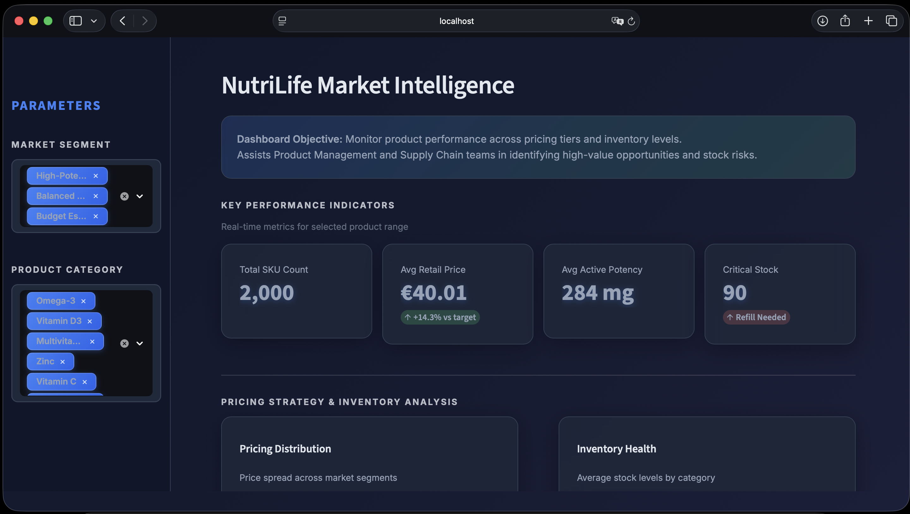
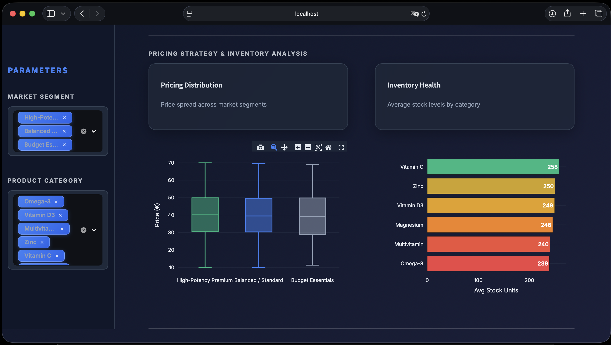
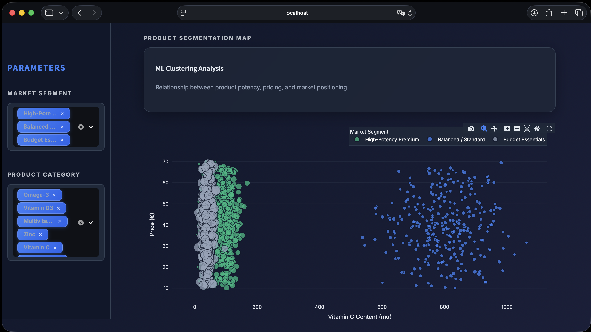
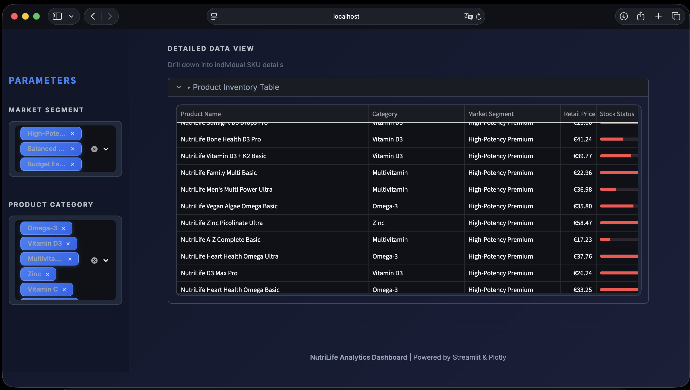

# 💊 NutriLife: Pharma Market Intelligence Dashboard

[](https://www.python.org/)
[](https://streamlit.io/)
[](https://plotly.com/)
[](https://duckdb.org/)
[](https://scikit-learn.org/)

**An end-to-end data engineering and analytics project simulating a pricing and inventory monitoring system for a pharmaceutical supplement company.**

---

## 📊 Executive Summary

The dashboard features a modern **"Dark Glassmorphism" UI** designed to provide a high-contrast analytical experience. The main view delivers real-time KPIs, highlighting total SKU count, average retail price, and critical stock alerts.



---

## 💼 Business Context

**Scenario:** "NutriLife", a mid-sized supplement manufacturer, manages a catalog of ~2,000 SKUs. The product management team lacks visibility into how pricing correlates with active ingredient potency and which high-value items are at risk of stock-outs.

**Solution:** I built a full-cycle analytical pipeline that generates realistic business data, processes it using SQL (DuckDB) and Python, applies Machine Learning for automated segmentation, and presents actionable insights via an interactive web app.

---

## 🔎 Feature Deep Dive

### 1. Pricing Strategy & Inventory Health
This section allows managers to audit the product portfolio structure:
* **Pricing Distribution (Box Plot):** Visualizes the price spread across segments. It validates that "Premium" products (Green) maintain a higher median price compared to "Budget" items (Grey), with clearly identifiable outliers.
* **Inventory Levels (Bar Chart):** Monitors average stock availability by category to prevent supply chain bottlenecks.



### 2. ML-Driven Market Segmentation
Instead of relying on manual price tags, I applied **Unsupervised Machine Learning (K-Means Clustering)** to segment products based on their chemical attributes (Vitamin C, Magnesium content) and price.

The scatter plot below visualizes these clusters:
* 🟢 **Green:** High-Potency Premium products.
* 🔵 **Blue:** Standard/Balanced formulations (specifically High Vitamin C).
* ⚪ **Grey:** Budget Essentials.



### 3. Actionable Inventory Data
The detailed data view allows supply chain managers to identify risks immediately. I implemented **embedded progress bars** within the data table to visually flag low stock levels (Red) versus healthy stock (Grey) without reading every number.



---

## 🛠️ Technical Workflow

1.  **Smart Data Generation:** Python script generates a realistic dataset where product names strictly match their categories and chemical composition (e.g., "Magnesium" products actually contain high magnesium).
2.  **ETL & SQL Enrichment:** Raw data is processed using **DuckDB**. SQL window functions and `CASE` logic are used to create preliminary rules and clean the data.
3.  **Machine Learning:** `Scikit-learn` is used to calculate clusters based on 3 dimensions: Price, Vit C, Magnesium.
4.  **Visualization:** Built with **Streamlit** and **Plotly Express**, customized with CSS injection for the glassmorphism look.

---

## 🚀 How to Run Locally

1.  **Clone the repository:**
    ```bash
    git clone https://github.com/kelemano/pharma-market-intelligence.git
    cd pharma-market-intelligence
    ```

2.  **Install dependencies:**
    ```bash
    pip install -r requirements.txt
    ```

3.  **Launch the Dashboard:**
    ```bash
    streamlit run dashboard_app.py
    ```
    The app should open automatically in your browser at `http://localhost:8501`.

